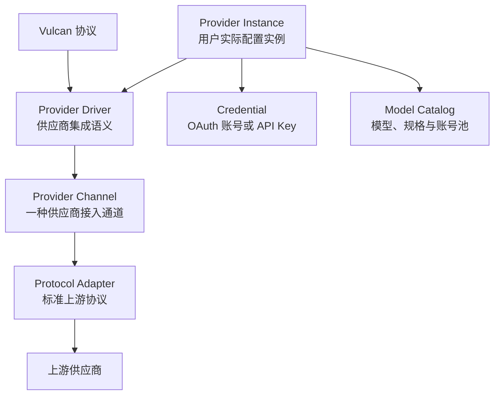
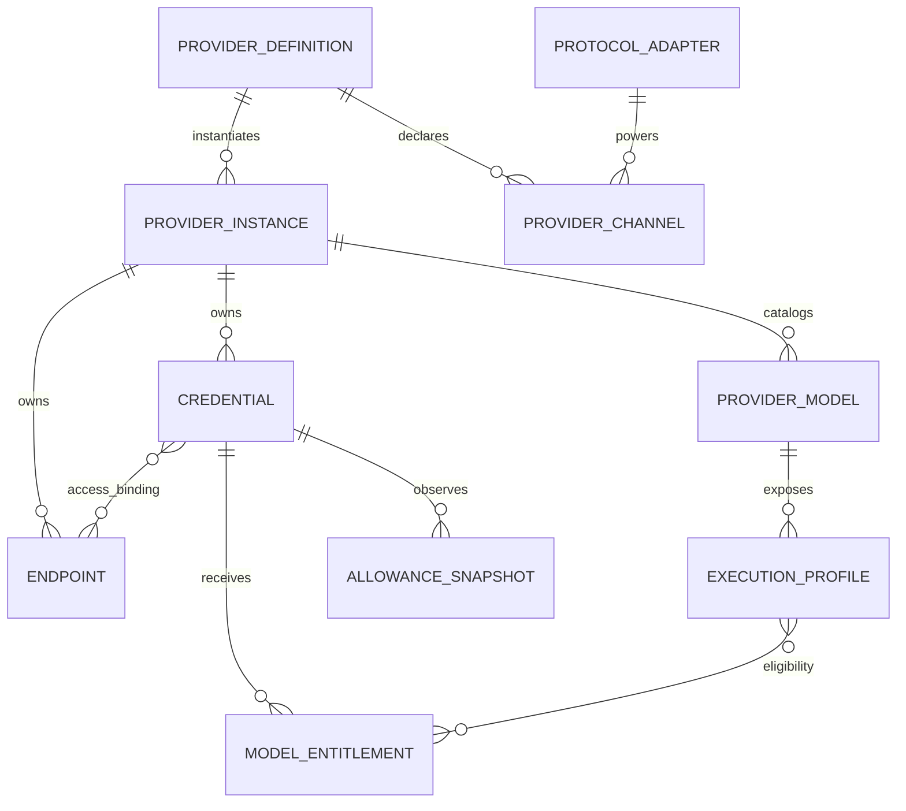

# ADR 0002：供应商配置与模型能力领域结构

- 状态：已接受
- 日期：2026-07-17
- 范围：领域结构、所有权、持久化边界与解析流程
- 非范围：Vulcan Responses 字段、供应商协议字段、HTTP API 路径与数据库物理 Schema

## 背景

Vulcan Model Core 需要同时支持两类供应商：

1. 系统内置供应商，例如 Kimi Coding Plan、ChatGPT Codex。这类供应商由 Core 直接提供集成库，拥有固定的协议通道、认证方式、模型发现、套餐、额度、错误分类和重试语义，用户不能修改其集成定义。
2. 用户自定义供应商，例如一个兼容 OpenAI Chat Completions 或 OpenAI Responses 的私有网关。这类供应商只绑定系统已实现的标准上游协议，配置端点、认证信息和模型；通常不处理供应商套餐、余额、OAuth 和专属错误语义。

供应商不能仅被建模为“名称 + 协议 + Key 列表”。系统内置供应商可能同时提供多个协议通道、多个认证方式、账号级模型授权、套餐级上下文限制、任意组合的额度窗口和余额计费。自定义供应商则需要保持简单，不能因为系统供应商的复杂性而被迫填写无关配置。

本设计只定义结构，不直接实现任何供应商协议。

## 设计目标

1. 系统内置供应商定义由代码和集成库拥有，用户只能创建实例、登录账号、添加凭据和启停实例。
2. 用户自定义供应商由配置存储拥有，用户选择一个可配置协议、设置端点和认证方式，并手工配置或拉取模型。
3. 协议适配、供应商业务语义、运行时配置和动态账号状态相互分离。
4. 同一供应商内部可以在合法的通道、端点、套餐和凭据之间容灾，但不得跨供应商融合或回退。
5. 模型能力按供应商、通道、规格和账号授权精确表达，不能按模型名称全局合并。
6. 套餐、模型授权和可消费额度相互独立。
7. 普通供应商保持单模型组和单默认规格；只有真实存在能力差异时才发布多个执行规格。
8. VulcanCode 可以获得模型、执行规格、账号池可用性和额度摘要，但不接触供应商原生协议和凭据秘密。

## 总体分层



### Vulcan 协议层

VulcanCode 只理解 Vulcan 协议。OpenAI Chat Completions、OpenAI Responses、Anthropic Messages、Gemini GenerateContent 等都是 Core 内部上游协议，不作为公共兼容端点暴露。

### Protocol Adapter

Protocol Adapter 负责标准上游协议的通用编解码能力，包括请求编码、响应解码、流式事件、工具参数、推理块、标准用量和通用错误信封解析。

Protocol Adapter 不负责供应商套餐、账号授权、余额、错误关键词和重试策略。

### Provider Driver

Provider Driver 是一个供应商的完整系统集成，组合协议通道、认证、端点、模型发现、套餐读取、授权解析、额度读取、错误分类和重试建议。

Provider Driver 通过 Go 组合复用 Protocol Adapter，不复制整套标准协议转换器，也不使用面向对象式继承。

### Provider Instance

Provider Instance 是某个用户、工作区或租户实际启用的供应商配置。它引用 Provider Definition，并拥有实例级设置、凭据、端点绑定和运行状态。

## 核心对象关系



## 标识体系

| 标识 | 示例 | 所有权 | 用途 |
| --- | --- | --- | --- |
| `provider_definition_id` | `system_chatgpt_codex` | 系统代码 | 内置供应商定义 |
| `provider_definition_id` | `custom_<UUIDv7>` | 配置存储 | 自定义供应商定义 |
| `provider_instance_id` | `pvi_<UUIDv7>` | 配置存储 | 实际供应商实例 |
| `provider_handle` | `work-codex` | 用户/工作区 | 客户端可读稳定别名 |
| `channel_id` | `anthropic` | Provider Driver | 供应商内部协议通道 |
| `credential_id` | `cred_<UUIDv7>` | 凭据存储 | 单个 OAuth 账号或 API Key |
| `endpoint_id` | `ep_<UUIDv7>` | 配置存储 | 单个上游端点 |
| `provider_model_id` | 供应商作用域稳定 ID | 模型目录 | 供应商逻辑模型 |
| `execution_profile_id` | 规格作用域稳定 ID | 模型目录 | 可由客户端选择的能力规格 |

约束：

1. `system_` 和 `custom_` 只用于 Provider Definition。
2. `custom_` 使用不可变随机标识，不从名称、URL 或协议计算。
3. `custom_` 保证身份唯一，但不等同于业务排重。相同 URL 可以对应不同组织、项目和账号体系。
4. 用户显示名称允许修改，不能作为外键或运行时路由键。
5. VulcanCode 使用工作区作用域的 `provider_handle`，内部存储仍使用不可变 ID。

## 系统内置供应商

### 保存策略

系统供应商的 Provider Definition 不作为可编辑数据库记录保存。它由 Core 中的 Provider Driver 库注册，是进程启动时的系统事实来源。

系统定义至少包含：

- 稳定的 `system_` ID；
- Driver 版本和配置 Schema 版本；
- 供应商通道；
- 允许的认证方式；
- 固定端点规则；
- 模型发现和静态回退目录；
- 套餐、模型授权和额度读取能力；
- 供应商错误规则和重试语义；
- 可执行能力和运行时就绪状态。

数据库只保存：

- Provider Instance；
- 用户可编辑的实例设置，例如名称、Handle、启停状态和允许的代理引用；
- Credential 元数据与 Secret 引用；
- Provider Driver 返回的动态快照；
- 当前实例引用的 Driver/Schema 版本；
- 运行时状态、修订号和审计信息。

用户不能修改系统供应商的：

- 协议类型和通道定义；
- 上游固定端点；
- OAuth 流程、Scope 和刷新规则；
- 模型能力规则；
- 套餐映射；
- 错误分类和重试规则；
- Provider Driver 代码。

系统定义升级后由 Driver 负责配置迁移。实例引用的版本不兼容时进入 `migration_required`，不得静默删除或继续使用旧语义。

### Provider Driver 组成

```text
Provider Driver
├── Provider Definition
├── Provider Channels
├── Auth Drivers
├── Endpoint Policy
├── Model Discoverer
├── Plan Reader（可选）
├── Entitlement Reader（可选）
├── Allowance Reader（可选）
├── Error Classifier
├── Retry Advisor
├── Usage Normalizer
└── Capability Resolver
```

可选能力必须返回明确的 `supported`、`unsupported` 或 `temporarily_unavailable` 状态，不能通过空字段猜测。

## 用户自定义供应商

### 保存策略

自定义供应商的 Provider Definition 是持久化配置，使用 `custom_` ID。它不注册新的 Go 代码，只引用系统已经注册且允许用户配置的 Protocol Adapter。

第一阶段自定义定义保存：

- `custom_` Definition ID；
- 用户显示名称；
- 一个上游协议 Profile 及其版本；
- Base URL 和协议允许的端点设置；
- 通用认证方式；
- 手工模型配置和模型拉取设置；
- 配置 Schema 版本、修订号和生命周期状态。

第一阶段自定义供应商不负责：

- 供应商套餐识别；
- 上游余额查询；
- 五小时、周、月等专属额度读取；
- 任意 OAuth 流程；
- 供应商特有错误关键词；
- 自定义脚本、转换代码或插件执行；
- 跨供应商模型融合。

自定义供应商使用协议级通用 HTTP 错误、`Retry-After` 和连接错误分类。用户本地设置的预算或限流属于 Vulcan 治理策略，不伪装成供应商真实套餐或余额。

### 可配置协议

自定义供应商只能选择 Protocol Adapter Registry 中同时满足以下条件的协议 Profile：

- `user_configurable = true`；
- `runtime_ready = true`；
- 具有固定、版本化的配置 Schema；
- 具有明确的认证配置类型；
- 通过协议合同测试。

初始协议候选可以包括 OpenAI Chat Completions、OpenAI Responses、Anthropic Messages 和 Gemini GenerateContent，但是否开放由对应 Adapter 的就绪状态决定。

自定义定义第一阶段只绑定一个协议 Profile。修改协议会改变模型、认证和流式语义，因此已经启用或包含 Credential 的定义不能原地切换协议；应创建新的自定义供应商。

### 自定义认证

第一阶段仅支持通用且可静态描述的认证：

- Bearer Token；
- 指定 Header 的 API Key；
- 指定 Query 参数的 API Key；
- 明确允许的无认证本地服务。

同一个自定义 Provider Instance 可以录入多个 Credential，并在该实例内部容灾。任意 OAuth、Cookie、设备码或复杂签名认证必须由系统 Provider Driver 实现。

### 自定义模型

自定义供应商支持两种模型来源：

1. Protocol Adapter 支持模型拉取时，通过 Adapter 的 Model Discoverer 拉取上游模型。
2. 上游不支持模型列表时，由用户手工添加模型。

拉取结果至少保存上游模型 ID、显示名称、来源、拉取时间和修订号。协议模型列表通常不能证明上下文、工具、推理和多模态能力，因此未获得证据的能力保持 `unknown`，不能自动声明为完整支持。

用户可以为自定义模型补充上下文和能力配置；这些值标记为 `user_declared`，与系统验证能力区分。

## Protocol Adapter Registry 与 Provider Driver Registry

Core 使用两个独立注册表：

### Protocol Adapter Registry

按版本化协议 Profile 注册标准上游协议能力。系统 Provider Driver 和自定义供应商都可以引用它。

### Provider Driver Registry

按 `system_` Provider Definition ID 注册系统供应商集成。只有代码和受信任库可以向该注册表注册，普通配置不能创建 Driver。

当前最小框架的“Provider ID 到 Adapter”注册关系后续应拆成 Driver Registry、Adapter Registry 和 Provider Repository。运行时自定义实例不能通过复制或动态注册 Adapter 来实现。

## Provider Channel

一个系统 Provider Driver 可以声明一个或多个 Channel。Channel 表示同一供应商的一种完整接入方式，而不仅是协议名称。

Channel 至少关联：

- Protocol Adapter Profile；
- Endpoint Profile；
- 支持的认证方式；
- 模型和能力约束；
- 可选的 Channel 级错误覆盖；
- 稳定优先级和运行时状态。

例如同一供应商产品即使上游声称兼容多个协议，系统 Definition 仍只选择一个经过完整验证的优势 Channel。Kimi Coding Plan 固定使用 OpenAI Chat；Credential 是否能使用该 Channel 由 Access Binding 明确表达，不能运行时猜测或动态切换协议。

自定义供应商第一阶段只有一个 Channel，其 Channel 由所选协议 Profile 自动形成。

## Provider Instance、Endpoint 与 Access Binding

Provider Definition 描述集成类型，Provider Instance 描述用户实际配置。

系统允许同一个 Definition 创建多个 Instance，以支持不同工作区、组织、区域、代理和隔离账号池。即使第一阶段 UI 默认只创建一个实例，持久化模型也不应把 Definition 与 Instance 合并。

Endpoint 与 Credential 不默认形成笛卡尔积。Access Binding 明确记录一个 Credential 可以访问哪些 Channel、Endpoint、模型或区域。

最终执行目标是：

```text
Provider Instance
+ Provider Channel
+ Endpoint
+ Credential
+ Provider Model
+ Execution Profile
+ Upstream Model ID
```

## Credential 与 Secret

每个 OAuth 账号或 API Key 是独立 Credential 记录，不作为 Provider Instance JSON 中的 Key 数组保存。

Credential 元数据包括：

- Credential ID；
- Provider Instance ID；
- Auth Method ID；
- 用户标签；
- 上游账号主体标识；
- Secret 引用和不可逆指纹；
- 状态、过期时间、Scope 和刷新时间；
- 当前健康、冷却和错误摘要；
- 创建、更新时间和修订号。

Secret 材料只存储在 Secret Store。普通配置、日志、Catalog、审计和导出文件不得包含明文 Token、Refresh Token、Cookie 或 API Key。

OAuth 登录使用独立、短生命周期的 Auth Session。登录成功后，Driver 根据稳定上游主体标识新增或更新 Credential；同一账号重复登录不能创建重复 Credential。

Token 刷新需要单账号并发锁和原子 Secret 轮换。

## 模型结构

### Provider Model

Provider Model 是供应商作用域的逻辑模型。上游模型字符串只在对应 Provider/Channel 内有意义，不能按名称跨供应商合并。

### Model Offering

Model Offering 表示某个模型在确定 Channel 和 Endpoint 规则下的可执行产品。相同上游模型 ID 在不同供应商或 Channel 中可以具有不同能力和限制。

### Execution Profile

Execution Profile 是 VulcanCode 可选择的模型能力规格。只有存在客户端可感知的能力差异时才创建多个 Profile，例如 Kimi K3 的 256K 和 1M 上下文。

大部分模型只有一个默认 Profile，VulcanCode 不显示规格选择器。

Execution Profile 可以描述：

- 上下文、最大输入和最大输出；
- 工具调用、并行工具和严格 Schema；
- 推理能力和控制方式；
- 输入输出模态；
- 所需授权类别；
- 会话切换策略；
- 账号池调度策略。

同名模型不能自动建立等价关系。同一供应商多 Channel 的模型也只有在 Driver 显式声明语义等价时才允许内部选择。

## 模型授权

Model Entitlement 表示一个 Credential 是否有权使用某个 Provider Model 或 Execution Profile，以及账号级限制覆盖。

授权状态包括：

- `allowed`；
- `denied`；
- `conditional`；
- `unknown`；
- `temporarily_unavailable`。

系统供应商的有效授权由 Driver 合并以下证据：

1. 系统静态模型定义；
2. 套餐默认授权；
3. 供应商 API 实际下发模型；
4. 账号级灰度、白名单或限制；
5. 明确的运行时错误反馈。

Codex 某些模型只下发给特定账号时，只调整模型的 Eligible Credential Pool；如果账号获得模型后的能力相同，不额外创建 Profile。

自定义供应商没有套餐授权解析。手工模型默认对实例中所有符合 Channel/Endpoint 绑定的 Credential 可用；拉取接口如果按 Credential 返回不同模型，则可以形成 Credential 级授权快照。

## Plan、Entitlement 与 Allowance

这三个概念严格分离：

```text
Plan：账号属于什么商业套餐
Entitlement：套餐和账号允许调用哪些模型、以什么规格调用
Allowance：当前还可以消费多少资源
```

### Plan Snapshot

Plan Snapshot 是系统 Provider Driver 获取的动态账号商业信息。Plan 名称不是权限判断的唯一依据，账号灰度可以覆盖套餐默认值。

### Entitlement Class

多个套餐可以映射到相同授权类别。例如多个高级套餐都允许 Kimi K3 使用 1M 上下文。授权类别避免按营销套餐名称复制模型能力规则。

### Allowance Snapshot

Allowance 是通用可消费资源，支持任意数量和组合：

- 五小时、周、月等 Window Quota；
- 现金余额；
- 供应商 Credits；
- 有效期 Credit Grant；
- 供应商自定义计量资源。

Window Quota 需要表达滚动窗口、日历窗口或供应商定义窗口。月额度不能默认等价为滚动三十天。

Balance 和 Credit 必须保留真实单位。供应商 Credit 没有明确兑换关系时不能伪装成法定货币。金额不能用浮点数保存。

Allowance Scope 可以是 Credential、Subscription、Organization、Project、Billing Account、Provider Model、Execution Profile 或 Capability。

多个 API Key 共享同一 Billing Account 时必须引用同一余额快照。余额不足时在这些 Key 之间切换没有意义。

系统 Provider Driver 可以实现 Plan、Entitlement 和 Allowance Reader；自定义供应商第一阶段不实现这些 Reader。

## 模型池与多规格反馈

模型池由运行时根据 Execution Profile、Credential Entitlement、Allowance 和健康状态动态计算，不作为手工维护的 Credential 列表保存。

三类差异分别处理：

1. 模型能力不同：创建多个 Execution Profile，前端可选。
2. 账号模型权限不同：调整 Eligible Credential Pool，不复制模型。
3. 额度结构不同：保留在 Credential/Billing Scope 的 Allowance 中，不复制 Profile。

例如 Kimi K3：

```text
K3 / 256K Profile
  eligible entitlement classes: 256K, 1M

K3 / 1M Profile
  eligible entitlement classes: 1M
```

1M Credential 也可以执行小上下文请求，但默认调度使用 `prefer_smallest_sufficient`，优先消耗刚好满足请求的低规格账号，避免浪费稀缺高规格额度。

VulcanCode 获得每个 Profile 的聚合池摘要：

- 已配置账号数；
- 已授权账号数；
- 当前可用账号数；
- 冷却、额度耗尽、认证失效数量；
- 阻塞的 Allowance 类型；
- 最早恢复时间；
- Pool Revision 和观测时间。

Profile 定义是稳定目录项。账号暂时耗尽时 Profile 保留，并标记 `cooling`、`not_configured`、`not_entitled` 或 `temporarily_unavailable`，避免前端选项反复消失。

## 错误分类与重试建议

Protocol Adapter 只解析 HTTP 状态、Header、`Retry-After`、结构化错误信封和原始供应商请求 ID。

系统 Provider Driver 的 Error Classifier 再将其解释为供应商业务错误，例如：

- 套餐模型未授权；
- 五小时窗口耗尽；
- 周/月额度耗尽；
- 余额不足；
- Credential 无效；
- Model 或 Endpoint 过载；
- Provider 系统繁忙。

错误分类必须返回：

- 稳定 Vulcan Category；
- 影响 Scope；
- 是否允许相同目标重试；
- 是否允许切换 Credential；
- 是否允许切换 Endpoint；
- Retry/Reset 时间；
- 匹配的规则 ID 和供应商请求 ID。

系统错误规则使用版本化、声明式规则和脱敏黄金样本。优先匹配结构化错误码、类型和 Header，最后才允许受限文本规则。未知 429 不得猜测成套餐或某个额度窗口。

自定义供应商使用协议通用错误分类，不允许普通用户为系统供应商修改错误规则。

## Catalog 与 Management 视图

### VulcanCode Catalog

Catalog 是只读、脱敏的执行目录，提供：

- Provider Handle 和状态；
- Provider Model；
- Execution Profile；
- 有效能力和限制；
- 聚合账号池状态；
- 可执行性和不可用原因；
- Catalog/Pool Revision 和数据新鲜度。

Catalog 不提供 Secret、Refresh Token、完整上游错误 Body 或 Credential 敏感身份。

### Management 视图

管理视图提供：

- Provider Instance 配置；
- Credential 标签和认证状态；
- 系统供应商套餐、授权和额度详情；
- 自定义供应商端点、协议和模型配置；
- 拉取模型、刷新状态、启停和删除操作；
- 审计和迁移状态。

余额属于敏感计费信息。公共 Catalog 默认只返回余额状态；精确余额只在有权限的管理视图中展示。

## 生命周期

### 系统供应商实例

1. 从 Driver Registry 选择只读 `system_` Definition。
2. 创建 Provider Instance。
3. 选择 Driver 声明的 OAuth、Device Flow 或 API Key 方式。
4. 每次登录或录入形成独立 Credential。
5. Driver 获取模型、Plan、Entitlement 和 Allowance 快照。
6. Core 生成模型池和 Catalog。
7. 实例达到可执行条件后进入 `ready`。

### 自定义供应商实例

1. 选择允许用户配置的 Protocol Profile。
2. 配置名称、Handle、Base URL 和通用认证方式。
3. 生成 `custom_` Definition 和 Provider Instance。
4. 添加一个或多个 API Key Credential。
5. 通过协议 Adapter 拉取模型，或手工添加模型。
6. 校验连接和模型配置。
7. 生成默认 Execution Profile 和 Catalog。
8. 达到可执行条件后进入 `ready`。

### 建议状态

```text
draft
validating
ready
degraded
disabled
migration_required
deleting
```

配置无效、Driver 缺失或 Schema 不兼容必须显式进入不可执行状态，不能静默回退到其他供应商或协议。

## 请求解析流程

```text
Provider Handle + Model + Execution Profile
→ 定位唯一 Provider Instance
→ 定位 Provider Model 和 Profile
→ 过滤 Model Entitlement
→ 过滤 Context/Capability 限制
→ 过滤全部强制 Allowance
→ 过滤 Credential、Endpoint 和 Channel 健康状态
→ 应用同供应商池策略
→ 生成不可变 Resolved Execution Target
→ 执行
```

Resolved Execution Target 在请求生命周期内不可改变。配置热更新、Catalog 刷新和新 Credential 加入不能影响已经开始的请求。

流已经产生对外输出后不得透明切换 Credential 或重放请求。显式选择的 Execution Profile 不得静默降级，除非请求明确允许降级且实际上下文仍满足降级规格。

## 持久化所有权

| 数据 | 来源 | 持久化策略 |
| --- | --- | --- |
| Protocol Adapter 定义 | Core 库 | 不作为用户配置持久化 |
| `system_` Provider Definition | Provider Driver 库 | 不复制成可编辑记录 |
| `custom_` Provider Definition | 用户配置 | 持久化并版本化 |
| Provider Instance | 用户/系统创建 | 持久化 |
| Endpoint 与 Access Binding | 实例配置 | 持久化 |
| Credential 元数据 | 用户登录/录入 | 持久化 |
| Credential Secret | Secret Store | 加密持久化 |
| 系统模型静态定义 | Provider Driver | 不作为用户配置修改 |
| 自定义模型配置 | 用户或模型拉取 | 持久化并记录来源 |
| Plan/Entitlement/Allowance | 系统 Provider Driver | 快照持久化或缓存，带有效期 |
| Pool Summary | Core 派生 | 不作为事实来源，按修订重建 |
| Resolved Execution Target | 单次请求 | 仅请求生命周期保存 |

## 版本与一致性

至少维护以下版本：

- Driver Version；
- Provider Config Schema Version；
- Protocol Profile Version；
- Model Catalog Revision；
- Entitlement Revision；
- Allowance/Pool Revision。

热更新采用不可变快照。新修订只影响后续请求。

系统 Provider Definition、模型能力和错误规则只能随受信任 Core/Driver 更新。自定义供应商的配置修改形成新修订并经过重新验证。

## 安全边界

1. 自定义 Base URL 必须经过 URL、协议、重定向、DNS 和内网访问策略校验。
2. 系统供应商的固定端点不能由普通用户覆盖。
3. 所有 Secret 通过引用使用，禁止进入普通配置和日志。
4. 模型列表、额度和错误 Body 需要脱敏后才能进入诊断数据。
5. 导出配置默认排除 Secret 和精确余额。
6. 删除 Provider Instance 前检查 Credential、模型选择、活动请求和路由引用。

## 建议包边界

```text
internal/protocol/             标准上游协议 Adapter Registry
internal/provider/             Provider Driver 合同与 Registry
internal/provider/system/      系统供应商实现
internal/provider/custom/      通用自定义供应商 Driver
internal/providerconfig/       Definition、Instance、Endpoint 和 Binding
internal/credential/           Auth Session、Credential 和 Secret 引用
internal/catalog/              Model、Profile、Entitlement 和 Catalog
internal/allowance/            Quota、Balance、Credit 与 Pool 状态
internal/resolve/              单供应商执行目标解析
internal/store/                持久化接口与实现
```

这只是所有权边界建议，不代表本 ADR 要求立即创建全部包。

## 强制不变量

1. 一个请求解析为一个 Provider Instance，执行期间 Provider 不可改变。
2. 系统供应商定义只由受信任 Driver 库注册，用户不能覆盖。
3. 自定义供应商只能引用已注册、已版本化且允许用户配置的 Protocol Profile。
4. 自定义供应商第一阶段不实现套餐、余额和专属错误规则。
5. 模型名称不构成跨供应商等价关系。
6. 模型能力差异、账号授权差异和额度差异分别建模。
7. 未知能力不是支持，未知额度不是零。
8. 不存在固定的五小时、周、月字段，额度使用任意 Allowance 集合表达。
9. 只有客户端可感知的能力差异才创建多个 Execution Profile。
10. 同供应商容灾只能在满足 Profile、Entitlement、Allowance 和 Access Binding 的目标中进行。
11. 系统定义、用户配置、动态快照和请求派生状态不能共享同一个可变大对象。

## 非目标

- 不在本 ADR 中确定 Vulcan Responses 的 JSON 字段。
- 不在本 ADR 中确定 HTTP 管理接口路径。
- 不在本 ADR 中确定 SQLite/PostgreSQL 表结构。
- 不实现任意插件脚本或用户自定义协议转换器。
- 不允许用户修改系统供应商的模型、套餐、认证和错误规则。
- 不实现跨供应商模型路由、同名模型融合或跨供应商故障转移。

## 决策结果

本 ADR 建议采用双来源供应商体系：

- `system_`：代码拥有、Driver 库实现、定义只读、运行时只保存实例和凭据。
- `custom_`：配置拥有、绑定系统协议 Adapter、支持端点、多个 Key、手工模型和模型拉取，不承担系统供应商业务语义。

两类供应商共享 Provider Instance、Credential、Model Catalog、Execution Profile 和单供应商执行解析框架；Plan、Entitlement、Allowance、OAuth 和供应商专属错误只由实现相应能力的系统 Provider Driver 提供。
